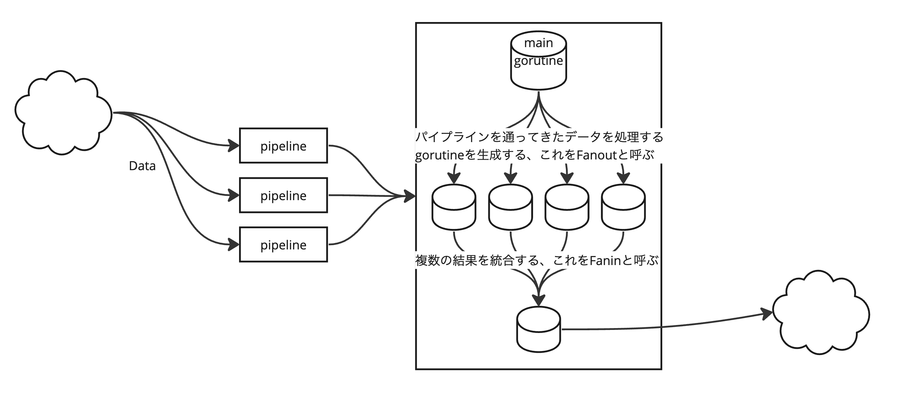

# 5章 大規模開発での並行処理
## エラー伝播


# 4章
## ファンイン・ファンアウト
> ファンアウトはパイプラインからの入力を扱うために複数のゴルーチンを起動するプロセスを説明する用語です。そしてファンインは複数の結果を1つのチャネルに結合するプロセスを説明する用語です。


## パイプライン
データを受け流す通路のこと。Golangで言えば、Channelがこれに該当する。
パイプラインを通って渡ってきたデータを処理する場所をステージと呼ぶ。Golangで言えば、関数がこれに該当する。
repeatで生成された値がvalueStreamに渡されて、渡されるたびにtakeStreamに値が渡されていく。
```go
	repeat := func(done <-chan interface{}, values ...interface{}) <-chan interface{} {
		valueStream := make(chan interface{})
		go func() {
			defer close(valueStream)
			for {
				for _, v := range values {
					select {
					case <-done:
						return
					case valueStream <- v:
					}
				}
			}
		}()
		return valueStream
	}

	take := func(done <-chan interface{}, valueStream <-chan interface{}, num int) <-chan interface{} {
		takeStream := make(chan interface{})
		go func() {
			defer close(takeStream)
			for i := 0; i < num; i++ {
				select {
				case <-done:
					return
				case takeStream <- <-valueStream:
				}
			}
		}()
		return takeStream
	}

	done := make(chan interface{})
	defer close(done)

	for num := range take(done, repeat(done, 1), 10) {
		fmt.Printf("%v ", num)
	}
```

## 拘束
> 拘束は、情報をたった1つの並行プロセスからのみ得られることを確実にしてくれる単純ですが強力な考え方です。これが確実に行われたときには、並行プログラムは暗黙的に安全で、また同期がまったく必要なくなります。拘束は2種類存在しています。アドホックとレキシカルの2つです。

アドホックはチーム内の暗黙的なルールによってデータを一つの並列スレッドで扱うことを守る思想。これは簡単に破られるので、著者はレキシカルを推している。
レキシカルはコンパイラに守らせるやりかた。レキシカルスコープをうまく使ってチャネルへの読み込みと書き込み、データの読み込みと書き込みを分離する。
```go
printData := func(wg *sync.WaitGroup, data []byte) {
    defer wg.Done()

    var buff bytes.Buffer
    for _, b := range data {
        fmt.Fprintf(&buff, "%c", b)
    }
    fmt.Println(buff.String())
}

var wg sync.WaitGroup
wg.Add(2)
// dataを引数として渡すことで複数gorutineで間違ったデータにアクセスしないようになっている
data := []byte("golang")
go printData(&wg, data[:3])     // ❶
go printData(&wg, data[3:])     // ❷

wg.Wait()
```

# 3章
クリティカルセクションとは
> クリティカルセクションは、プログラムが共有リソースに対する排他的アクセスを必要とする場所のことでした

## sync package
### MutexとRWMutexについて
MutexのLockとRWMutexのRLockの違いを説明してる
Mutexのロックは読み取り/書き込みどちらの理由だろうと、Lockを取るとそれがクリティカルセクションになる。
RLockは読み取り専用のLockであり、RLockを実行するgorutineが任意の数あってもクリティカルセクションにはならず、Lockを呼び出すgorutineがあるときにLock/RLockを待機させる。

### Condについて
CondのWait, Broadcast, Signal, Lock, Unlockについて説明している。
condはconditionの略っぽい。
Waitでコンテキストのgorutineが停止する。SignalやBroadcastをgorutineで呼ぶことで一番長くWaitしているgorutineを動作させることができる。

### Poolについて
生成コストの高いオブジェクトをキャッシュしておき、それを並列化されたgorutineで使い回すことができる。
PoolにはGetとPutメソッドがあり、Getでキャッシュからオブジェクトを読み込み、Putでキャッシュへオブジェクトを戻せる。
Poolを扱うときは、次の点に気をつけましょう。
- sync.Poolをインスタンス化するときは、呼び出されるときにスレッド安全なNewメンバー変数を用意する。
- Getでインスタンスを取得するとき、受け取るオブジェクトの状態に関して何も想定してはいけない。
- プールから取り出したオブジェクトの利用が終わったらPutを確実に呼ぶこと。さもなければ、Poolは役に立たない。通常はdeferを使ってこれを行う。
- プール内のオブジェクトはおよそ均質なものであるべき。

### Channelについて
並列化されたgorutine間でメモリを同期するためのデータ構造。ch型で表される。
チャネルへの読み込みと書き込みはブロックされるので、こういうコードがよくある。
```go
intCh := make(chan int)

go func(i int) {
  <-intCh
  fmt.Println("this gorutine is blocked until other gorutines writes any data to intCh")
}(i)
```

チャネルには書き込みと読み込みの型がある。こんな感じ。
- readは `<-chan int`
- writeは `chan<- int`

この型を使うことでチャネルの所有権を型で定義することができる。そうすることでより安全な並列処理を書ける。

### selectについて
指定された1つ以上のチャネルを均一に処理するための文


### 参考
- https://dev.to/karanpratapsingh/go-course-sync-package-5c3m
  - これ、かなり中身が似てる気がする

# Go言語による並行処理読み始め
https://www.oreilly.co.jp/books/9784873118468/ を読む。いったん1章読んだ。
## Coffman条件
デッドロックが発生するために存在しなければならない条件というのがいくつかある。
それをCoffman条件と呼ぶ。
```
Coffman条件は次のとおりです。

- 相互排他
ある並行プロセスがリソースに対して排他的な権利をどの時点においても保持している。
- 条件待ち
ある並行プロセスはリソースの保持と追加のリソース待ちを同時に行わなければならない。
- 横取り不可
ある並行プロセスによって保持されているリソースは、そのプロセスによってのみ解放される。
- 循環待ち
ある並行プロセス（P1）は、他の連なっている並行プロセス（P2）を待たなければならない。そしてP2はP1を待っている。
```

一旦、さっさとコードに入りたいので、2章を飛ばして3章を読む。あとで2章を読む。


